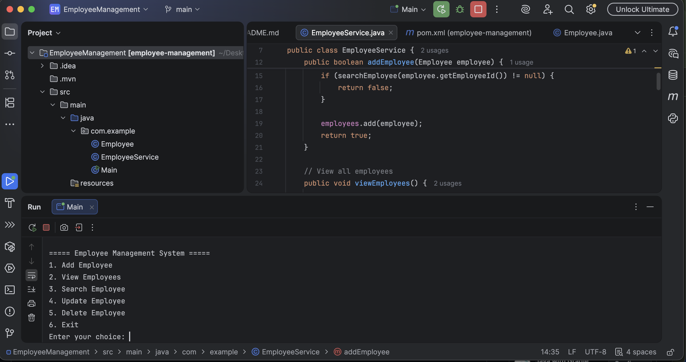
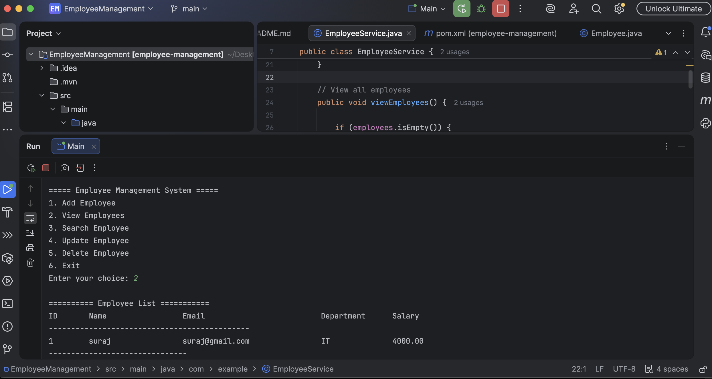

# Employee Management System

A console-based Employee Management System developed using **Java 17** and **Maven**.

## Features

- Add Employee
- View All Employees
- Search Employee by ID
- Update Employee
- Delete Employee
- Duplicate Employee ID validation
- Input validation
- Exception handling
- Empty employee-list handling
- Formatted employee table
- Sort employees by salary

## Technologies Used

- Java 17
- Maven
- IntelliJ IDEA
- ArrayList
- Object-Oriented Programming

## OOP Concepts Used

### Encapsulation
Employee fields are declared `private` and accessed through getters and setters.

### Constructor
The `Employee` constructor initializes employee details when an employee object is created.

### Classes and Objects
The project separates employee data, business logic, and application execution into different classes.

### Collections
`ArrayList<Employee>` is used to store employee objects.

### Exception Handling
Invalid numeric input is handled using `try-catch` blocks so that the application does not crash.

## Project Structure

```text
EmployeeManagement
│
├── src
│   └── main
│       └── java
│           └── com.example
│               ├── Employee.java
│               ├── EmployeeService.java
│               └── Main.java
│
├── screenshots
│   ├── 1ss.png
│   └── 2ss.png
│
├── pom.xml
└── README.md
```

## How to Run

1. Open the project in IntelliJ IDEA.
2. Make sure Java 17 or higher is configured.
3. Open `Main.java`.
4. Run the `main()` method.
5. Use the console menu to manage employees.

## Employee Fields

Each employee contains:

- Employee ID
- Name
- Email
- Department
- Salary

## Application Menu

```text
1. Add Employee
2. View Employees
3. Search Employee
4. Update Employee
5. Delete Employee
6. Sort Employees by Salary
7. Exit
```

## Data Storage

Employee data is currently stored in an `ArrayList` during program execution.

The data is stored in memory and will be cleared when the application is restarted.

## Screenshots

### Application Menu



### Employee List



## Validation and Error Handling

The application validates:

- Employee ID must be a positive number.
- Duplicate employee IDs are not allowed.
- Name cannot be empty.
- Email cannot be empty.
- Department cannot be empty.
- Salary cannot be negative.
- Invalid numeric input is handled without crashing.
- Appropriate messages are displayed when an employee is not found.
- An appropriate message is displayed when there are no employees.

## Future Improvements

Possible future enhancements:

- File-based employee storage
- Database integration
- JUnit testing
- Department-based search
- Sorting by name or department
- GUI interface